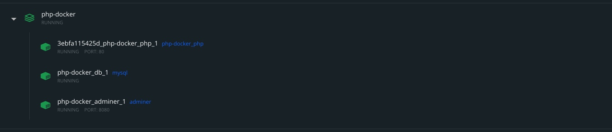

> M300 LB03 Dokuemntation - Arbeiten mit Docker - Levin Kuhn

# **Modul300 Dokumentation der LB03 Docker**

   
    
     
> **Inhaltsverzeichnis**    

- [**Modul300 Dokumentation der LB03 Docker**](#modul300-dokumentation-der-lb03-docker)
- [**1 Einführung**](#1-einführung)
  - [**1.1 Einleitung**](#11-einleitung)
  - [**1.2 Was ist Docker?**](#12-was-ist-docker)
  - [**1.2 Wichtige Befehle und deren Bedeutung von Docker Images**](#12-wichtige-befehle-und-deren-bedeutung-von-docker-images)
  - [**1.2 Wichtige Befehle und deren Bedeutung von Docker Container**](#12-wichtige-befehle-und-deren-bedeutung-von-docker-container)
- [**2 Code Dokumentation**](#2-code-dokumentation)
  - [**2.1 erstes Dockerfile ohne docker-compose**](#21-erstes-dockerfile-ohne-docker-compose)
  - [**2.2 index.php File**](#22-indexphp-file)
  - [**2.3 Apache**](#23-apache)
  - [**2.4 docker-compose.yml**](#24-docker-composeyml)
  - [**2.5 docker-compose.yml Code Dokumentation**](#25-docker-composeyml-code-dokumentation)
  - [**2.6 index.php Code Dokumentation**](#26-indexphp-code-dokumentation)
- [**3 Erweiterungen**](#3-erweiterungen)
- [**4 Sicherheit**](#4-sicherheit)
- [**5 Final Test**](#5-final-test)
- [**6 Reflektion**](#6-reflektion)
- [**7 Quellen**](#7-quellen)

---------------------

# **1 Einführung**  

## **1.1 Einleitung**

Das hier ist die Dokuemntation des Moduls 300 der LB03, in welchem wir Services mit Docker autmoatisieren werden. Zur Realisierung wird Docker und Markdown verwendet. Markdown haben wir bereits kennengelernt und wird hier nicht mehr beschrieben. Docker hingegn ist neu und wird auch hier in der Dokumenntation  Zum einen wird der Code beschrieben, mit welchem wir alles aufegsetzt haben und zum anderen werden auch Fortschritte hier verzeichnet.

Ich habe mich dazu entschieden mit Hilfe von PHP, MYSQl und Apache, eine kleine Website zu "bauen", welche ihre Informationen via DB abholt. Was genau auf der Website stehen soll ist noch nicht definiert. 

## **1.2 Was ist Docker?**

„Docker“ ist eine Containerisierungstechnologie, die die Erstellung und den Betrieb von Linux-Containern ermöglicht. 

## **1.2 Wichtige Befehle und deren Bedeutung von Docker Images**

- ***build*** = Image erstellen
- ***pull*** = Image oder Repo von Registry ziehen
- ***ls*** = zeigt alle vorhandenen Images
- ***history*** = Alle Infos von einem Image
- ***inspect*** = Detailiertere Infos zu Image, was geschieht auf welchem Layer
- ***rmi*** = Image Löschen

## **1.2 Wichtige Befehle und deren Bedeutung von Docker Container**
- ***create*** = Container aus Image erstellen
- ***start*** = existierenden Container starten
- ***run*** = erstellt neuen Container und startet ihn zugleich
- ***ls*** = listet alle *LAUFENDEN* Container auf
- ***inspect*** = Detailierte Infos über Container
- ***logs*** = zeigt logs an
- ***stop*** = stoppt laufenden Container
- ***kill*** = Stoppt Hauptprozess in einem Containner sofort
- ***rm*** = löscht einen gestoppten container

--------------------

# **2 Code Dokumentation**

## **2.1 erstes Dockerfile ohne docker-compose**

    FROM php:7.4-cli

  >*zuerst wurde dieser Eintrag im Dockerfile benutzt. Im grunde sagt dies es soll die nachfolgenden zeilen von php 7.4 holen*

    COPY . /usr/src/myapp

  >*Hier wird der Kontent der momentan laufenden Directory in das ensprechende Verzeichnis (Docker Container) kopiert.*
    
    WORKDIR /usr/src/myapp

  >*Diese Linie sagt dass "/usr/src/myapp" als "arbeitendes Verzeichnis" läuft also als würde man cd "zu/meinem/projekt" machen.*

    CMD [ "php", "./index.php" ]

  >*Diese Linie Sagt, dass wir das File "index.php" im Ornder "/usr/src/myapp" ausführen, welches dann unser PHP script anzeigt.*

## **2.2 index.php File**

    <?php

  >*Hier sagen wir dem File das der folgende Code in PHP geschrieben wird*

    echo "Hello from the docker m300 container"

  >*Mit einem "echo" können wir eine kleiner Ausgabe schreiben, welche dann auf der Website erscheint.*

***Danach wurden noch die folgenden Commands ausgeführt:***

    docker build -t my-php-app .

  >*Diese Zeile sagt es soll unser neues Image namens "my-php-app" mit Hilfe des Inhalts der momentan befinden directory kreieren.*

    docker run -it --rm --name my-running-app my-php-app

 >*Diese Zeile sagt es soll einen Container kreieren, welcher auf dem neu erstellten Image basiert.*

 ***Nun sollte man so etwas heruas bekommen:***
 
    Hello from the docker container

## **2.3 Apache**

    docker run -d -p 80:80 --name my-apache-php-app -v "$PWD":/var/www/html php:7.2-apache

>*Diese Zeile sag, dass Apache aus dem aktzuellen Folder gestartet werden soll und es definiert noch welche verison wir für den Apache Webserver nehmen "7.2"*

Wenn wir nun http://localhost:80 aufrufen sollten wir dies bekommen:

--------------------------- 
***Im nächsten Schritt wird beschrieben, wie es mit eienem docker-compose file funktioniert, und dies ist auch die Varianten für welche ich mich schlussendlich auch entschiednen habe.***

***Bevor wir unser docker-compose.yml Datei erstellen, müssen wir noch unseren eben erstellten Container stoppen. Wenn man nur einen Container stoppen will kann man dies mit dem Befehl "docker stop container_id" tun. Ich habe in diesem Fall den Befehl "docker stop $(docker ps -a -q)" verwendet, welcher mir alle meine laufenden container stoppt.***

---------------------------                                                                            
## **2.4 docker-compose.yml**

    version: '3.1'

    services:
     php:
      image: php:7.4-apache
      ports:
       - 80:80
      volumes:
       - ./src:/var/www/html/

>*Erste Datei*
    
    
    version: '3.1'

    services:
        php:
          build:
             context: .
             dockerfile: Dockerfile
          ports:
           - 80:80
          volumes:
           - ./src:/var/www/html/
  

        db:
          image: mysql
          command: --default-authentication-plugin=mysql_native_password
          restart: always
          environment:
           MYSQL_ROOT_PASSWORD: example 

        adminer:
          image: adminer
          restart: always
          ports:
           - 8080:8080

>*Zweite Datei*

---------------------------    

## **2.5 docker-compose.yml Code Dokumentation**

***Hier ist die erste .yml Datei***

    version: '3.1'

>*Diese Zeile definiert einfach welche docker-compose version verwendet wird.*

    services:

>*Diese Zeile listet die Container auf welche erstellt werden sollen.*  

    php:

>*Wir geben dem Container den Namen "php".*

    image: php:7.4-apache

>*Das Image soll php 7.4 sein. Zuerst hatte ich es nämlich mit 7.2 versucht.*

    ports:
      - 80:80

>*Hier kommt das Port mapping, von unserem Port 80 zum Port 80 der Maschine .*

    volumes:
      - ./src:/var/www/html/

>*Zum Schluss kommt unser Zeug vom src (Source) Folder in den /src:/var/www/html/ Ordner des Containers.*

***Nun habe ich ein docker-compose up -d ausgeführt und localhost:80 aufgerufen. Da unsere Ornder nun verknüpft sind, kann man kurz testen ob dies auch richtig funktioniert. Dazu änderte ich einfach kurz den Innhalt des index.php files. Lade dann localhost:80 kurz neu und die änderungen sollten zu sehen sein***

>*Vorher*

>*Nacher*

---------------------------

Im nächsten Schritt habe ich MySQL und Adminer (zwei Datenbank tools) aufgesetzt. Unser Ziel ist es PHP mit MySQl zu verknüpfen, dazu musste ich ein docker-compose.yml erstellen. So siet die zweite .yml Datei aus:

        version: '3.1'

        services:
         php:
          build:
           context: .
           dockerfile: Dockerfile
          ports:
           - 80:80
          volumes:
           - ./src:/var/www/html/

>*Unser PHP Dienst sieht nun Final anderst aus, da wir noch einige mysql Dienste installieren müssen, um unsere PHP-Seite mit der Datenbank zu verbinden. Wir sagen, dass wir ein Dockerfile verwenden um das Image php7.4-Apache anzupassen. Zudem verwende ich den docker Befehl "build" um den Inhalt im aktuellen Verzeichniss verwenden (neues Dockerfile wird nochmals unten beschrieben)*

        db:
         image: mysql
         command: --default-authentication-plugin=mysql_native_password
         restart: always
         environment:
          MYSQL_ROOT_PASSWORD: example 

        adminer:
         image: adminer
         restart: always
         ports:
          - 8080:8080

>*Hier habe ich ein Datenbankdienst hinzugefügt welcher auf dem MySQL-Image beruht. Zudem habe ich einen Befehl für das Passwort und einen für die Neustartrichtlinie hinzugefügt. Danach habe ich das Root-Passwort auf "example" gesetzt, mit welchem wir uns auf der Datenbank anmelden können (siehe Bild). Beim abschnitt Adminer habe ich die Ports auf 8080:8080 gesetzt, um mit localhost:8080 auf das Admin-DB-Tool zu kommen (Bilder folgen weiter unten)*

***Hier nochmals das vorhin erwänte nun abgeänderte Dockerfile. Wir wollen mysql so einrichten, dass es wieder so wie alles im PHP-Container funktioniert.***

    FROM php:7.4-apache

>*Hier sagen wir einfach, dass das 7.4-Apache PHP-Image verwendet werden soll, um unseren Container zu erstellen.*

    RUN docker-php-ext-install mysqli

>*In dieser Zeile wird bestimmt, dass MySQL Erweiterungen im Container heruntergeladen und ausgeführt werden können.*

***Nun haben wir alles was wir brauchen. Führen wir nun den Befehl "docker-compose up -d" aus, sollten wir auf folgeneden URL kommen:***

http://localhost:8080 ----> Admin-DB-Tool

>*hier können wir uns mit dem USer "root" dem Passwort "example" anmelden*

>*Hier habe ich eine Datenbank namens "M300" erstellt.*

>*Als nächstes habe ich eine Tabelle erstellt namens "users" mit den einträgen name und fav-color welche wir in unserem neuen index.php File brauchen werden.*

***Nun kommen wir zum neuen index.php File***

## **2.6 index.php Code Dokumentation**

    <?php

    echo "Hello from the docker m300 container";

    $mysqli = new mysqli("db", "root", "example", "M300");

    $sql = "INSERT INTO users (name, fav_color) VALUES('Levo', 'blau')";
    $result = $mysqli->query($sql);
    $sql = "INSERT INTO users (name, fav_color) VALUES('Albin', 'grün')";
    $result = $mysqli->query($sql);
    $sql = "INSERT INTO users (name, fav_color) VALUES('Das ist ein Test funktionierts?', 'mais oui')";
    $result = $mysqli->query($sql);
    $sql = "INSERT INTO users (name, fav_color) VALUES('burim', 'weiss')";
    $result = $mysqli->query($sql);

    $sql = 'SELECT * FROM users';

    if ($result = $mysqli->query($sql)) {
        while ($data = $result->fetch_object()) {
            $users[] = $data;
        }
    }

    foreach ($users as $user) {
        echo " ";
        echo $user->name . " " . $user->fav_color;
        echo " ";
    }

>*Das PHP-File Brauchen wir nun um Apache und die Datenbank miteinander zu verbinden. Dies macht die dritte Zeile dieses Files. Den Code habe ich uas einem ÜK-Modul kopiert und ist leider nicht weiter dokumentiert, da es nicht um PHP vertieft gehen soll. Jeodch habe ich nur die VALUES abgeändert, hier (name, fav_color) und den VALUES einen Inhalt gegeben. Leider kann man mit diesem nicht so viel anfangen und ich konnte es nicht mehr erweiteren, da es mir Wichtiger war die auf die vorgegebenen VM zu bringen*

***Jetzt ist aber alles aufgesetzt und PHP sollte mit der Datenbank veknüpft sein. Wenn wir localhost:80 aufrufen sollten wir folgendes zu sehen bekommen.***

---------------------------

# **3 Erweiterungen**

Zu den Erweiterungen zähl ich hier die MySQl Erweiterungen welche ich im Dockerfile beschrieben habe. Für weiter Erweiterungen fehlte leider die Zeit.

---------------------------

# **4 Sicherheit**

Zur Sicherheit zähle ich den Punkt, dass das Admihn-DB-Tool Passwort geschützt ist. Für weitere Sicherheitsaspekte fehlte die Zeit.

---------------------------

# **5 Final Test**

| Test  | Beschreib     | Auswertung |
| ------- | ------------- | ---------- |
| 1       | docker-compose up -d funktioniert und alles container werden gestartet |    |
| 2       | localhost:8080 ist ereichbar und Anmeldung erfolt über den user "root" mit dem Passwort "example" |        |
| 3       | localhost:80 ist erreichbar und PHP ist erfolgreich mit der erstellten Datenbank und Tabelle verknüpft. Werden Änderungen vorgenommen können diese sofort mit F5 aktualisert werden.            |       |
| 4       | docker-compose up -d auf Herr Bergers VM. Alles sollte gleich funktionieren.               | hat nicht geklappt auch nach mehreren Tagen von Troubleshooting konnte das Problem nicht gefunden und behoben werden.     |

---------------------------

# **6 Reflektion**

*Ich fande es sehr spannend etwas ganz neues zu erlenen, von dem ich bisher noch gar nie etwas gehört habe. Dank Youtube und kurzen Einlesungen fand ich schnell in das GRosse Thema Docker hinein und fnad auch gleich Spass am arbeiten. Im Grunde fand ich es nicht schwer sich Docker anzueignen und einfache Sachen hatte ich schnell gelernt, jeodch hatte ich auch grosse Hilfe vom Internet bezüglich von Youtube, welches mir das alles ein wenig vereinfachte. Auch mit der Zeit hatte ich zu Anfangs keine Pr4obleme und mein Projekt eigentlich schon früh "fertig". Als ich dann jedoch meine Docker Umgebung auf die VM von Herr Berger bringen sollte traten Probleme auf, welche ich nicht zu lösen wusste. Ich befasste mich stunden mit dem Troubleshooting und der Suche nach Fehlern, jedoch erfolglos. Ich bin entäuscht dass ich es nicht geschafft habe meine Dockerumgebung auf die VM zu bringen. Zudem finde ich ich hätte das Projekt noch sinnvoller erweitern können, wenn mit die Zeit gereicht hätte. Jetzt habe ich ein fertiges aber doch nicht ganz umgesetztes Projekt. Im grossen und ganzen bin ich aber sehr zufrieden mit meiner Arbeit und meinem Lernprozess welche ich durch dieses Projekt erlangen konnte. es hat mir sehr viel Spass gemacht mit Docker zu arbeiten und finde dies definitv eines von den spannensten Modulen*

---------------------------

# **7 Quellen**
- <https://www.digitalocean.com/community/tutorials/apache-configuration-error-ah00558-could-not-reliably-determine-the-server-s-fully-qualified-domain-name>
- <https://www.php.net/manual/de/language.expressions.php>
- <https://stackoverflow.com/questions/19937880/mysqliquery-couldnt-fetch-mysqli/26147425>
- <https://docs.docker.com/config/daemon/>
- <https://hub.docker.com/>

